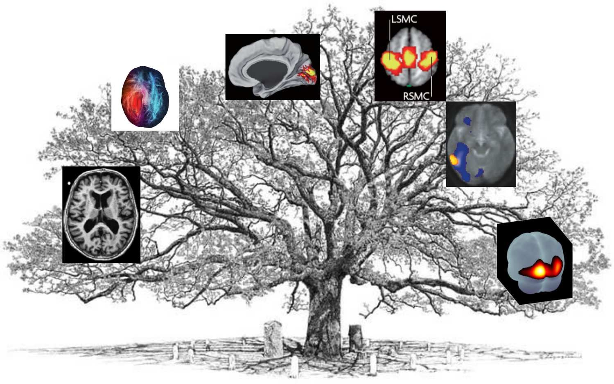

---
jupytext:
  cell_metadata_filter: -all
  formats: md:myst
  text_representation:
    extension: .md
    format_name: myst
    format_version: 0.13
    jupytext_version: 1.10.3
kernelspec:
  display_name: Python 3
  language: python
  name: python3
---

# Cartes cérébrales

```{warning}
Ce chapitre est en cours de développement. Il se peut que l'information soit incomplète, ou sujette à changement.
```

## Objectifs du chapitre
Ce premier chapitre a pour but de donner un aperçu du cours dans sa globalité. Il s'agit d'un format condensé, qui couvre l'ensemble des techniques d'imagerie que l'on va voir dans le cours. Si vous souhaitez prendre l'examen final et ne travailler qu'un seul chapitre, vous êtes au bon endroit. Mais cette stratégie n'est pas recommandée! Si au contraire vous souhaitez travailler la matière de chaque chapitre de façon approfondie, ce chapitre ne contient aucune information que vous ne trouverez pas ailleurs dans les notes de cours, avec plus de détails. Malgré tout, ce chapitre vous permettra d'apprécier le plan d'ensemble, et de rapidement faire des connexions entre les différentes techniques vues dans le cours.



Les techniques étudiées dans ce cours ont un commun de générer des cartes du cerveau. Ce sont aussi des outils centraux dans beaucoup d'études en neurosciences cognitives qui utilisent la neuroimagerie. Ces techniques incluent:
 * L'**imagerie par résonance magnétique (IRM) structurelle**. C'est la technique la plus connue en IRM. C'est une image qui permet de capturer la forme du cerveau. Elle permet aussi de voir différents types de tissus, et notamment la matière grise, là où sont les corps des neurones dans le cerveau.
 * L'**IRM de diffusion (IRMd)**. Il s'agit d'un autre type d'image que l'on peut acquérir avec le même appareil d'IRM que l'IRM structurelle. Cette technique permet de reconstruire les grands faisceaux de fibres, les connexions entre les neurones.
 * L'**IRM fonctionnelle (IRMf)** est encore un autre type d'IRM, qui permet de voir l'activité du cerveau. Il y a deux grandes techniques d'analyse en IRMf. Les cartes d'activation sont générées lorsque le sujet réalise une tâche dans l'IRM, et on va chercher les régions qui sont engagées quand le sujet effectue cette tâche. On peut également effectuer des analyses quand les sujets sont dans un état de repos, où on va regarder la cohérence de l'activité entre différentes régions. Il s'agit des cartes de connectivité fonctionnelle.  
 * La **tomographie par émission de positrons (TEP)**, qui n'utilise pas l'IRM (enfin!). Cette technique repose sur des traceurs radioactifs qui génèrent des rayons gamma, et des caméras qui détectent ces rayons gamma. Certains traceurs, comme le FDG, permettent de mesurer le métabolisme cérébral, en lien avec l'activité des neurones.
 * L'**imagerie optique**, qui mesure les changements de la couleur du sang dans le cerveau, et donc de son niveau d'oxygénation, qui est elle même reliée à l'activité des neurones.

 Les deux premières techniques, IRM structurelle et de diffusion, permettent d'étudier la structure du cerveau. Les trois dernières techniques (IRMf, TEP FDG et imagerie optique) mesurent toutes des phénomènes fonctionnels. Notez que, comme l'IRM, la TEP peut aussi être utilisé pour générer des cartes de la structure du cerveau. Toutes ces techniques ont des forces et faiblesses distinctes qui les rendent mieux adaptées à différents types d'application. L'objectif général du cours est pour vous de comprendre si la technique utilisée dans un article de recherche est bien adaptée à la question de recherche, ou bien pour votre propre recherche de déterminer quelle technique est la plus adaptée pour vos objectifs.

 ## Résolutions temporelle et spatiale
Les techniques vues dans ce cours ont en commun d'avoir une bonne résolution spatiale. Prise de notes interrompue à https://youtu.be/8rVGFa9xhkY?t=921

```{admonition} La résolution spatiale
:class: tip
La notion de résolution spatiale fait généralement référence à la taille minimale d'un objet que l'on peut distinguer dans une image. Si l'on parle de photo numérique, le plus petit objet est un pixel, soit un petit carré. Pour des cartes du cerveau, on parle de voxel, ou élément de volume 3D. Mais attention, deux images avec la même taille de pixel (ou voxel) peuvent avoir une résolution effective différente, si l'une des deux images est floue.

TODO: ajouter des images illustrant ces concepts.
```
