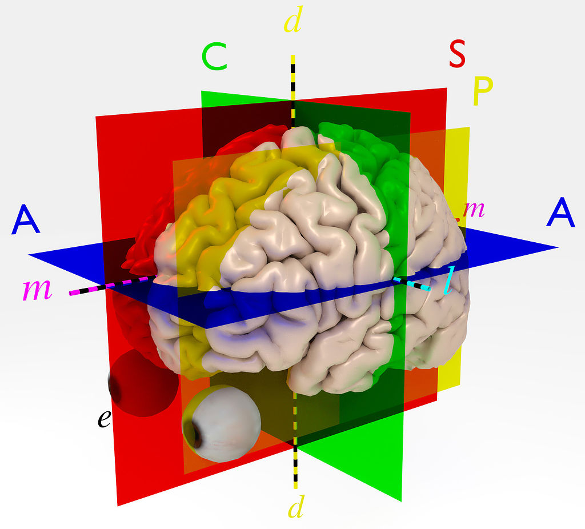

---
jupytext:
  formats: md:myst
  text_representation:
    extension: .md
    format_name: myst
kernelspec:
  display_name: Python 3
  language: python
  name: python3
---

# Cartes cérébrales

## Objectifs
```{figure} ./cartes_cerebrales/fig_cartes_cerebrales.png
---
width: 800px
name: cartes-cerebrales-fig
---
L'arbre de la neuroimagerie. Chaque branche représente une des techniques qui seront présentées durant le cours. Figure adaptée par P. Bellec à partir d'une variété de sources non libres de droit et inspirée du livre {cite:p}`wager2015`.
```
Ce premier chapitre a pour but de donner un aperçu du livre dans sa globalité. Toutes les techniques de neuroimagerie que l'on va voir ont des forces et faiblesses distinctes, ce qui les rendent mieux adaptées à différents types d'applications. Pour chaque technique, on vise ici à se familiariser avec quatre aspects:
 * Quel est le **principe physique** qui nous permet d'obtenir une mesure?
 * Quel est le **principe physiologique**, c'est-à-dire quel aspect biologique du cerveau mesure-t-on?
 * Quelles **méthodes d'analyse** sont nécessaires pour pouvoir interpréter les données?
 * Quelles **questions de recherche** peuvent être étudiées avec ces techniques?

## Imagerie structurelle et fonctionnelle
```{figure} ./cartes_cerebrales/fig_structure_fonction.png
---
width: 800px
name: structure-function-fig
---
Illustration des techniques structurelles et fonctionnelles étudiées dans ce livre, ainsi que quelques applications possibles en neurosciences cognitives. Figure adaptée par P. Bellec à partir d'une variété de sources non libres de droit et inspirée du livre {cite:p}`wager2015`.
```

Les techniques étudiées dans ce cours ont pour point commun de générer des cartes du cerveau. Ce sont aussi des outils centraux dans beaucoup d'études en neurosciences cognitives qui utilisent la neuroimagerie. Ces techniques incluent:
 * L'**imagerie par résonance magnétique (IRM) structurelle**. C'est la technique la plus connue en IRM. C'est une image qui permet de capturer la forme du cerveau. Elle permet aussi de voir différents types de tissus, et notamment la matière grise, là où sont les corps des neurones dans le cerveau.
 * L'**IRM de diffusion (IRMd)**. Il s'agit d'un autre type d'image que l'on peut acquérir avec le même appareil d'IRM que l'IRM structurelle. Cette technique permet de reconstruire les grands faisceaux de fibres, les connexions entre les neurones.
 * L'**IRM fonctionnelle (IRMf)** est encore un autre type d'IRM qui permet de voir l'activité du cerveau. Il y a deux grandes techniques d'analyse en IRMf. Les cartes d'activation sont générées lorsque le sujet réalise une tâche dans l'IRM. On va ainsi chercher les régions qui sont engagées quand le sujet effectue cette tâche. On peut également effectuer des analyses quand les sujets sont dans un état de repos. On va alors regarder la cohérence de l'activité entre différentes régions. Il s'agit des cartes de connectivité fonctionnelle.  
 * La **tomographie par émission de positrons (TEP)** est une technique qui n'utilise pas l'IRM (enfin!). Cette technique repose sur des traceurs radioactifs qui génèrent des rayons gamma et des caméras qui détectent ces rayons gamma. Certains traceurs, comme le FDG, permettent de mesurer le métabolisme cérébral en lien avec l'activité des neurones.
 * L'**imagerie optique** mesure les changements de la couleur du sang dans le cerveau, et donc de son niveau d'oxygénation, qui est lui-même relié à l'activité des neurones.

Les deux premières techniques, IRM structurelle et de diffusion, permettent d'étudier la **structure** du cerveau. Les trois dernières techniques (IRMf, TEP FDG et imagerie optique) mesurent toutes des **phénomènes fonctionnels**. Notez que, comme pour l'IRM, la TEP peut aussi être utilisée pour générer des cartes de la structure du cerveau.

## Résolutions spatiale et temporelle
```{figure} ./cartes_cerebrales/fig_resolution.png
---
width: 800px
name: resolution-fig
---
Illustration du compromis entre résolution temporelle et spatiale pour les techniques de neuroimagerie étudiées dans ce livre. Figure adaptée par P. Bellec à partir d'une variété de sources non libres de droit.
```

Les techniques vues dans ce cours ont en commun d'avoir une bonne résolution spatiale, mais il existe malgré tout des variations importantes entre chacune de ces techniques:
 * La meilleure de ce point de vue est l'**IRM structurelle** dont la résolution spatiale est excellente, avec des voxels d'environ 1 mm$^3$, soit un cube de 1 mm x 1 mm x 1 mm. Cela permet de voir la structure du cerveau avec beaucoup de détails.
 * L'**IRMd** est un peu moins bonne, avec une résolution spatiale plus proche de 2 mm x 2 mm x 2 mm (soit 8 mm$^3$).
 * L'**IRMf**, quant à elle, utilise couramment une résolution de 3 mm x 3 mm x 3 mm - soit 27 mm$^3$, ce qui est près de 30 fois plus gros que le voxel de l'IRM structurelle!
 * Enfin la **TEP** et l'**imagerie optique** ont une résolution spatiale plus grossière, plutôt équivalente à 1 cm x 1 cm x 1 cm (soit 1000 mm$^3$ !!). Même si les voxels de la TEP sont plus petits que 1 cm$^3$, l'image est "floue" et il n'est pas possible de distinguer de petites structures.

```{admonition} La résolution spatiale
:class: tip
La notion de résolution spatiale fait généralement référence à la taille minimale d'un objet que l'on peut distinguer dans une image. Si on peut distinguer des petits objets, la résolution est haute. Si l'on ne peut seulement voir que de gros objets, la résolution est basse. Si l'on parle de photo numérique, le plus petit objet possible est un pixel, soit un des petits carrés qui composent l'image. Pour des cartes du cerveau, on parle de voxel, ou élément de volume 3D.
```

```{warning}
:name: resolution-spatiale-warning
La résolution spatiale ne correspond pas simplement à la taille d'un pixel. Deux images avec la même taille de pixel (ou voxel) peuvent avoir une résolution effective différente si l'une des deux images est floue. Sur l'image nette on distingue des objets plus petits que sur l'image floue. La **résolution effective** de l'image nette est donc supérieure à celle de l'image floue.
```
En ce qui concerne la résolution spatiale, l'IRM structurelle peut apparaître comme étant la meilleure technique, mais il existe de multiples autres facteurs à considérer pour comparer des techniques de neuroimagerie. Un autre facteur important est la résolution temporelle. Les modalités structurelles capturent des changements qui sont lents à se mettre en place. La forme du cortex et les faisceaux de fibres se mettent en place tout au long du développement et du vieillissement, et ils sont assez stables même à l'échelle de plusieurs années. En revanche, l'IRM fonctionnelle, la TEP (utilisant le FDG) et l'imagerie optique examinent l'activité du cerveau. Elles mesurent des changements qui peuvent se produire à l'échelle de la minute, de la seconde ou même de la milliseconde.


```{admonition} La résolution temporelle
:class: tip
:name: resolution-temporelle-tip
La notion de résolution temporelle fait généralement référence à la durée minimale d'un événement que l'on peut distinguer dans un signal temporel. Les signaux que l'on voit dans le cours sont composés de mesures répétées dans le temps avec un intervalle $\Delta_t$, généralement mesuré en secondes. On parle parfois de la fréquence d'échantillonnage, $f=1/\Delta_t$, mesurée en Hz. La fréquence d'échantillonnage (Hz) représente le nombre de points de mesure par seconde.
```

```{warning}
:name: resolution-temporelle-warning
La résolution temporelle ne correspond pas simplement au temps qui s'écoulent entre deux mesures successives $\Delta_t$. Ce concept est plus difficile à visualiser que la résolution spatiale effective, mais est important en particulier dans le cas de l'imagerie optique. L'imagerie optique capture un phénomène vasculaire lent. Donc même si l'on a des pics d'activité séparés dans le temps au niveau neuronal, si l'intervalle de temps entre les pics est trop court on ne verra qu'un seul événement au niveau vasculaire. C'est l'équivalent d'une image floue, mais dans la dimension temporelle.
```

## Imagerie par résonance magnétique
```{figure} ./cartes_cerebrales/mri.jpg
---
width: 800px
name: mri-fig
---
Un appareil d'imagerie par résonance magnétique fonctionnelle. Image [shutterstock](https://www.shutterstock.com) ID `1866109303`.
```
Un appareil d'IRM est une machine imposante qui peut peser plusieurs dizaines de tonnes! L'élément le plus évident dans un système IRM est le tunnel relativement profond, qui est un aimant géant. Le sujet est installé sur une table qui peut se déplacer pour amener le sujet au centre de l'aimant. La raison pour laquelle on place le sujet de recherche à cet endroit est que le champ magnétique au centre de l'aimant est très homogène et pointe dans une direction constante. Ce champ magnétique homogène, appelé B0, est comme une toile vierge pour une peinture. De plus petits aimants, dits de gradients, seront allumés puis éteints rapidement pour venir modifier le champ magnétique dans différentes parties du cerveau. Comme différents tissus biologiques réagissent différemment à ces stimulations, les gradients nous permettent de "peindre" une image du cerveau sur la "toile" B0. On acquiert en fait une série d'images qui vont former un volume 3D couvrant tout le cerveau. Nous discuterons plus en détails du processus physique de génération d'une image IRM dans le chapitre {ref}`irm-chapitre`.

## IRM structurelle
```{code-cell} ipython 3
:tags: ["hide-input", "remove-output"]
# Ce code récupère des données IRM T1
# et génère une image dans trois plans de coupes

# Enlève les warnings
import warnings
warnings.filterwarnings("ignore")

# Télécharge un scan anatomique (template MNI152)
from nilearn.datasets import fetch_icbm152_2009
mni = fetch_icbm152_2009()

# Visualise le volume cérébral
import matplotlib.pyplot as plt
from nilearn.plotting import plot_anat

fig = plt.figure(figsize=(12, 4))
plot_anat(
  mni.t1,
  axes=fig.gca(),
  cut_coords=[-17, 0, 17],
  title='IRM en contraste T1'
)
fig.savefig(
  "cartes_cerebrales/t1-fig-intro.png",
  dpi=300,
  bbox_inches="tight",
  pad_inches=0
)
```

```{figure} cartes_cerebrales/t1-fig-intro.png
---
name: t1-fig-intro
---
Un exemple d'IRM structurelle (ici avec un contraste dit T1), sur trois plans de coupes: coronal (gauche), sagital (milieu) et axial (droite). Voir l'astuce {ref}`Naviguer à travers les coupes du cerveau<coupes-tip>` pour une explication de ces termes. Cette figure est générée par du code python à l'aide de la librairie [nilearn](https://nilearn.github.io/) à partir d'un jeu de données public appelé template MNI152 2009 {cite:p}`Fonov2011-xr` (cliquer sur + pour voir le code).
```
Le type d'image le plus couramment acquis avec un appareil d'IRM vise à caractériser la morphologie du cerveau. Comme on peut le voir dans la figure {ref}`ci-dessus <t1-fig-intro>`, on distingue aisément certains éléments anatomiques:
 * La **matière grise**, en périphérie du cortex, apparaît en gris foncé dans l'image. C'est là que les corps des neurones sont présents.
 * Il est aussi possible de distinguer la **matière blanche** (en gris clair) qui contient des paquets d'axones - c'est à dire les connexions entre les neurones.
 * Enfin, en **noir**, on peut voir des structures comme les ventricules, qui contiennent de l'eau, des nutriments, ainsi que des déchets métaboliques.

 La taille et la forme de ces structures peuvent varier en fonction de nombreux facteurs comportementaux ou démographiques. Par exemple, la quantité de matière grise diminue de manière massive avec l'âge: on parle d'**atrophie corticale**. Plusieurs techniques d'analyse des images ont été développées pour quantifier ces changements morphologiques, comme la **volumétrie**, la "**voxel-based morphometry**", ou bien encore les **analyses de surface**. Ces techniques seront présentées dans le chapitre {ref}`morphometrie-chapitre`.

```{admonition} Naviguer à travers les coupes du cerveau
:class: tip
:name: coupes-tip
Il existe trois axes principaux utilisés afin de découper le cerveau: coronal (C), sagital (S) et axial (A), tel qu'illustré dans la figure. Par ailleurs, certains termes sont utilisés couramment pour se repérer dans ces coupes:
 * l'axe `l` (ou `x`) va typiquement de la gauche vers la droite. Quand on est proche du milieu du cerveau, on parle d'une structure "médiale".
 * l'axe `m` (ou `y`) va de l'arrière du crâne (postérieur) vers le visage (antérieur). Par référence à la souris, antérieur se dit parfois "rostral" (vers le museau) et postérieur se dit parfois "caudal" (vers la queue).
 * l'axe `d` (ou `z`) va des pieds vers la tête. La direction des pieds s'appelle "ventral" et la direction de la tête s'appelle "dorsal". Cette terminologie est logique quand on pense à une souris et illogique pour l'humain - mais on l'utilise quand même!

Principaux plans de coupe en imagerie cérébrale. Figure par JonRichfield sous licence CC BY-SA 4.0, tirée de [wikimedia](https://commons.wikimedia.org/w/index.php?curid=36397692).
```

## IRM fonctionnelle
```{figure} ./cartes_cerebrales/fig_volumes4D.png
---
width: 800px
name: volumes4D-fig
---
Les données d'IRMf sont constituées d'une série de volumes cérébraux. Chaque voxel est associé à une série temporelle. Figure tirée de la [documentation Nilearn](https://nilearn.github.io/manipulating_images/masker_objects.html) sous licence BSD.
```
L'IRM fonctionnelle est une modalité d'imagerie 4D. C'est à dire qu'au lieu d'acquérir un seul volume cérébral, on en acquiert une série, séparés par un intervalle de temps appelé temps de répétition (`TR`) (aussi appelé $\Delta_t$ dans la {ref}`note sur la résolution temporelle <resolution-temporelle-tip>`). Le `TR` varie de quelques centaines de millisecondes (peu courant) jusqu'à 2 ou 3 secondes. Le nombre de répétitions varie de quelques dizaines à quelques centaines. Pour chaque voxel, on a donc une série de points de mesure, qui peuvent être représentés comme une série temporelle. Pour être capable d'obtenir des volumes du cerveau aussi vite, on doit utiliser de gros voxels, qui vont de 2x2x2 mm$^3$ (peu courant) jusqu'à 3x3x3 mm$^3$ (plus standard). Avec cette résolution, on a à peu près 50k voxels dans la matière grise (plus de 100k quand la résolution est proche de 2x2x2 mm$^3$).

```{code-cell} ipython 3
:tags: ["hide-input", "remove-output"]
# Ce code récupère des données d'IRMf
# et génère une image d'un volume dans trois plans de coupes

# Enlève les warnings
import warnings
warnings.filterwarnings("ignore")

# Télécharge un scan fonctionnel (ADHD200)
from nilearn.datasets import fetch_adhd
adhd = fetch_adhd(n_subjects=1)

# Visualise le volume cérébral
from nilearn.plotting import plot_img
from nilearn.image import index_img
fig = plt.figure(figsize=(12, 4))
plot_img(index_img(adhd.func[0], 0),
              bg_img=None,
              axes=fig.gca(),
              cut_coords=(36, -27, 66),
              black_bg=True,
              cmap="turbo",
              title="un volume IRMf")
fig.savefig(
  "cartes_cerebrales/irmf-fig.png",
  dpi=300,
  bbox_inches="tight",
  pad_inches=0
)
```

```{figure} cartes_cerebrales/irmf-fig.png
---
name: irmf-fig
---
Exemple d'un unique volume dans une série IRMf. Le volume est représenté sur trois plans de coupes: coronal (gauche), sagittal (milieu) et axial (droite). Voir l'astuce {ref}`Naviguer à travers les coupes du cerveau<coupes-tip>` pour une explication de ces termes. Remarquez que la résolution du volume est bien moins élevée que pour l'{ref}`IRM anatomique <t1-fig-intro>`, et que l'on a beaucoup de mal à voir les détails de l'anatomie du cerveau. Cette figure est générée par du code python à l'aide de la librairie [nilearn](https://nilearn.github.io/) à partir d'un jeu de données public appelé ADHD200 {cite:p}`HD-200_Consortium2012-uv, BELLEC2017275` (cliquer sur + pour voir le code).
```

Ces mesures ne reflètent pas directement l'activité des neurones, mais plutôt l'oxygénation du sang. On parle de signal dépendant du niveau d'oxygénation dans sang, ou signal BOLD (pour *Blood Oxygen Level Dependent*, en anglais). Comme on le verra dans la section {ref}`couplage-neurovasculaire-section`, ce signal BOLD reflète malgré tout de manière indirecte l'activité des neurones et va nous permettre de faire des cartes de l'activité du cerveau. Il y a deux types majeurs de techniques d'analyse en IRMf:
 * les **cartes d'activation**: avec cette approche, on va faire effectuer certaines tâches au participant de recherche. Pour chaque voxel dans le cerveau, on va alors regarder si le niveau d'activité BOLD est plus élevé durant une certaine tâche d'intérêt que lors d'une tâche de contrôle. On va parler de ce type de technique d'analyse dans le chapitre {ref}`irmf-chapitre`.
 * les **cartes de connectivité**: avec cette approche, on demande généralement au participant de recherche de rester au repos, sans faire de tâche particulière. On va alors examiner à quel point l'activité spontanée de différentes régions du cerveau est similaire, ou synchrone. Un fort niveau de synchronie suggère que ces régions sont engagées dans un processus cognitif spontané similaire et forment donc un réseau fonctionnel. On va parler de ce type de technique d'analyse dans le chapitre {ref}`connectivite-chapitre`.


(couplage-neurovasculaire-section)=
## Couplage neurovasculaire
```{figure} ./cartes_cerebrales/fig_cerveau_vasculaire.jpg
---
height: 600px
name: cerveau-vasculaire-fig
---
Rendu 3D réaliste de la vascularisation cérébrale. Image [shutterstock](https://www.shutterstock.com) ID `1571296897`.
```
Le cerveau ne représente que 2% de la masse corporelle, mais consomme 20% de l'oxygène! Le cerveau a donc besoin d'un apport régulier et important de sang frais qui est régulé de manière fine, aussi bien au niveau spatial (quelles régions reçoivent beaucoup de sang) que temporel (l'afflux de sang frais change au cours du temps). La concentration locale en sang oxygéné varie en fonction du niveau d'activité local des populations de neurones. C'est grâce à ce mécanisme de **couplage neurovasculaire** que l'on peut mesurer l'activité du cerveau indirectement au moyen de la vascularisation. C'est sur ce phénomène de couplage que repose aussi bien l'IRMf, que l'imagerie optique ou bien la TEP par FDG. Toutes ces techniques sont avant tout des techniques d'imagerie vasculaires et ne sont seulement qu'indirectement liées à l'activité neuronale. Le couplage neurovasculaire est présenté plus en détails dans le chapitre {ref}`irmf-chapitre`.

## IRM de diffusion
```{figure} ./cartes_cerebrales/fig_dissection_virtuelle.jpg
---
width: 800px
name: dissection-virtuelle-fig
---
À gauche, une coupe de cerveau post-mortem préparée pour mettre en valeurs les faisceaux de fibres de matière blanche. À droite, une dissection virtuelle des faisceaux de matière blanche générée grâce à des données d'IRM de diffusion. Image [shutterstock](https://www.shutterstock.com) ID `412065940`.
```
L'IRM de diffusion est encore une autre variété d'image que l'on peut acquérir, toujours à l'aide d'un appareil d'IRM. Cette fois, la manière d'exciter le champ magnétique local est spécialement conçue pour être sensible à la manière dont les molécules d'eau diffuse à travers un voxel. Ce type de mesure est répété de nombreuses fois avec des directions différentes et il est ainsi possible de déterminer dans quelle direction les molécules d'eau diffusent principalement. Cette information nous renseigne indirectement sur la microstructure de la matière blanche, car les faisceaux de fibres constituées d'axones reliant les neurones entre eux viennent contraindre la manière de diffuser de l'eau. À l'aide de techniques sophistiquées de modélisation, il est possible de reconstruire en 3D la géométrie des principales fibres de matière blanche et d'en quantifier l'intégrité au moyen de différentes métriques. Ces métriques peuvent alors être associées à différentes mesures comportementales, démographiques ou cliniques, comme par exemple, un historique de traumatisme crânien. Cette technique d'imagerie sera présentée plus en détails dans le chapitre {ref}`irm-diffusion-chapitre`.

## Imagerie optique
```{figure} ./cartes_cerebrales/fig_optique.png
---
width: 800px
name: optique-fig
---
Illustration schématique du parcours de la lumière proche infrarouge au travers de la boîte crânienne et du cerveau. Image par Dr Julien Cohen-Adad et Dr Claudine Gauthier.
```
L'imagerie optique est notre première technique qui n'utilise pas l'IRM! Mais le phénomène physiologique capturé par l'imagerie optique est identique à celui qui est à l'origine du signal BOLD en IRMf. Il s'agit du {ref}`couplage neurovasculaire <couplage-neurovasculaire-section>`. Ce phénomène permet d'exploiter le fait que la concentration en hémoglobine oxygénée reflète de manière indirecte l'activité neuronale. La grande différence entre l'imagerie optique et l'IRMf est la manière de mesurer les changements vasculaires. L'imagerie optique, aussi parfois appelée spectroscopie proche infra-rouge (ou *near-infrared spectroscopy* (NIRS) en anglais), utilise le fait que la lumière proche infra-rouge peut traverser la boîte crânienne ainsi que les tissus cérébraux superficiels. Par un phénomène de diffusion, la lumière envoyée directement dans la boîte crânienne va ressortir non loin de la source. En analysant le contenu spectral, ou autrement dit la couleur, de la lumière qui a traversé le cerveau, on peut déduire la concentration locale en hémoglobine oxygénée et dé-oxygénée. Ces deux molécules ont en effet des couleurs différentes et absorbent la lumière proche infra-rouge très différemment. La résolution spatiale de l'imagerie optique est bien plus limitée que celle de l'IRMf car les mesures sont effectuées au niveau du scalp, comme en EEG, plutôt que grâce à une image complète du cerveau avec des voxels cubiques de taille contrôlée. En revanche, il est possible de prendre des mesures à l'échelle de la milliseconde. Il est important de se rappeler malgré tout que le phénomène temporel étudié reste le couplage neurovasculaire et que ce phénomène est lent (voir l'avertissement concernant la {ref}`résolution temporelle effective <resolution-temporelle-warning>`). Cette technique d'imagerie sera présentée plus en détails dans le chapitre {ref}`imagerie-optique-chapitre`.

## Tomographie par émission de positrons
```{figure} ./cartes_cerebrales/fig_tep.jpg
---
width: 800px
name: tep-fig
---
Montage de coupes axiales d'un scanner TEP avec un radiotraceur FDG, illustrant le niveau d'activité métabolique du glucose durant la durée du scan. Image [shutterstock](https://www.shutterstock.com) ID `1342194254`.
```
La dernière modalité de neuroimagerie que ce livre présente est la TEP. Le fonctionnement de la TEP est basé sur l'injection d'un produit radioactif, appelé radiotraceur, dans le sang du participant de recherche. Cela peut sembler effrayant, mais pas d'inquiétude. La dose radioactive à laquelle est exposé le participant est faible et sans danger si l'on ne répète pas l'examen trop souvent. Le radiotraceur va aller s'accumuler dans certains tissus du cerveau et émettre des rayons gamma. Les rayons gamma sont en fait une forme de lumière (photons) à très haute énergie. Il est possible de détecter de façon précise l'origine de ces rayons gamma à l'aide d'une série de caméras disposées autour de la tête du sujet et d'ensuite reconstruire une carte du cerveau qui reflète la concentration en radiotraceur à chaque voxel. Le radiotraceur auquel nous ferons principalement référence durant ce cours est le fluorodeoxyglucose (FDG). Celui-ci est consommé comme carburant de manière indirecte par les neurones, tout comme l'oxygène. La TEP par FDG fonctionne donc grâce au {ref}`couplage neurovasculaire <couplage-neurovasculaire-section>`, tout comme l'IRMf et l'imagerie optique. Il faut en revanche plusieurs minutes pour bâtir une carte de l'activité cérébrale, donc la résolution temporelle de la TEP est inférieure à celles de l'IRMf et de l'imagerie optique. Par ailleurs, comme vous pouvez l'observer sur les images ci-dessus, les cartes TEP reconstruites sont floues et la {ref}`résolution spatiale effective <resolution-spatiale-warning>` des images est inférieure à la taille des voxels. Enfin, il est important de savoir que beaucoup d'autres traceurs existent en dehors du FDG. Il existe notamment des traceurs structuraux. Tout comme pour l'IRM, la TEP peut donc être utilisée pour générer des images structurelles et fonctionnelles du cerveau. Cette technique d'imagerie sera présentée plus en détails dans le chapitre {ref}`tep-chapitre`.

## Cartes statistiques
```{code-cell} ipython 3
:tags: ["hide-input", "remove-output"]
# Importe les librairies de visualisation
# et prépare le layout de la figure
import numpy as np
import seaborn as sns
import matplotlib.pyplot as plt
sns.set_theme(color_codes=True)
fig = plt.figure(figsize=(12, 4))

# Télécharge les données tips et visualise une régression
ax_plot = plt.subplot(1, 2, 1)
tips = sns.load_dataset("tips")
sns.regplot(x="total_bill", y="tip", data=tips, ax=ax_plot);

# Enlève les warnings
import warnings
warnings.filterwarnings("ignore")

# Télécharge un contraste d'activation motrice depuis NeuroVault
from nilearn import datasets
motor_images = datasets.fetch_neurovault_motor_task()
stat_img = motor_images.images[0]

# Visualise le volume cérébral
from nilearn.plotting import plot_stat_map
ax_plot = plt.subplot(1, 2, 2)
plot_stat_map(stat_img,
              threshold=3,
              axes = ax_plot,
              title="carte d'activation motrice",
              cut_coords=[36, -27, 66]
              )
fig.savefig(
  "cartes_cerebrales/regression-fig.png",
  dpi=300,
  bbox_inches="tight",
  pad_inches=0
)
```

```{figure} cartes_cerebrales/regression-fig.png
---
name: regression-fig
---
Gauche: illustration d'une régression linéaire entre une variable indépendante sur l'axe des x (aussi appelé facteur d'explication) et une variable dépendante sur l'axe des y. La droite représente la meilleure relation linéaire entre x et y et l'intervalle de confiance statistique est également indiqué. Droite: un modèle de régression est appliqué à chaque voxel pour générer une carte cérébrale statistique. Ici, la carte statistique correspond aux changements d'activation IRMf lors d'un mouvement de la main. La figure de régression est adaptée de ce [tutoriel seaborn](https://seaborn.pydata.org/tutorial/regression.html) à l'aide du jeu de données `tips`. La carte statistique est visualisée grâce à ce [tutoriel nilearn](https://nilearn.github.io/auto_examples/01_plotting/plot_demo_plotting.html#sphx-glr-auto-examples-01-plotting-plot-demo-plotting-py) et une carte d'activité motrice distribuée via [NeuroVault](https://neurovault.org/). Cliquez sur + pour voir le code.
```

Le dernier aspect important qui sera abordé dans ces notes de cours est une discussion sur la manière d'analyser les données. Cela implique notamment les étapes d'analyse d'images qui sont nécessaires pour générer des mesures interprétables. Cela implique aussi de faire des statistiques sur les images du cerveau que l'on génère. Il existe de nombreuses manières d'effectuer ces analyses statistiques et le domaine des neurosciences cognitives utilise de plus en plus des techniques multivariées d'apprentissage machine. Mais la technique de référence reste le modèle de régression linéaire qui est appliqué indépendamment à chaque voxel. Il s'agit d'un modèle très flexible qui permet de répondre à un grand nombre de questions, aussi bien au niveau individuel que de groupe. Le modèle de régression linéaire est utilisé par l'ensemble des techniques de neuroimagerie vues durant le cours. Le fait de répéter un test statistique à chaque voxel, des dizaines de milliers de fois, pose aussi un problème lorsque vient le temps d'établir le seuil de significativité. Nous discuterons de la régression linéaire et des approches de seuillage dans le chapitre {ref}`cartes-statistiques-chapitre`. Enfin, il est possible d'abuser de ce type de modèle statistique de multiples manières et ainsi amener à la publication de résultats non reproductibles. Nous discuterons de ces défis et de solutions possibles dans le dernier chapitre: {ref}`reproductibilite-controverses-chapitre`.

## Conclusions
Ce chapitre vous présente un rapide tour d'horizon des différentes méthodes utilisées en neurosciences cognitives qui disposent d'une bonne résolution spatiale. Nous espérons que cela vous donne envie d'en apprendre davantage et d'explorer les chapitres de ce livre!

## Exercices

```{admonition} Exercice 1
:class: note

On effectue une stimulation visuelle durant 200 ms et on souhaite étudier la réponse cérébrale au niveau du cortex occipital. Vrai ou faux:
 1. L’IRMf permet de mesurer séparément l’activité de différentes régions dans le système visuel.
 2. L’IRMf permet de séparer l’activité neuronale durant la phase précoce (0-100 ms) par rapport à la phase tardive (100ms-200ms) de l’expérience.
 3. L’imagerie optique permet de séparer l’activité neuronale durant la phase précoce (0-100 ms) par rapport à la phase tardive (100ms-200ms) de l’expérience.
```

```{admonition} Exercice 2
:class: note

Classez ces techniques selon leur résolution spatiale (à partir de la plus précise):
 1. IRMf
 2. IRM structurelle
 3. TEP
```

```{admonition} Exercice 3*
:class: note
Classez ces techniques selon leur résolution temporelle (à partir de la plus précise):
 1. TEP
 2. Imagerie optique
 3. IRM de diffusion
```

```{admonition} Exercice 4
:class: note
On observe une activation IRMf du cortex moteur ipsilatéral dans le cadre d’un mouvement de la main droite, suite à accident vasculaire cérébral (AVC) qui va perturber de manière importante le fonctionnement vasculaire. Choisissez la bonne réponse:
 1. Cette activation indique que le participant utilise le cortex ipsilatéral pour compenser les dommages liés à l’AVC.  
 2. Cette activation reflète un fonctionnement anormal du système vasculaire, et pas l’activité neuronale.
 3. On ne peut pas interpréter cette observation avec certitude.
```

```{admonition} Exercice 5
:class: note
Un participant à une étude a souffert d’un accident ayant laissé des débris métalliques dans son oeil par le passé.
 1. Citez une technique d’imagerie pour laquelle il s’agit d’une contre-indication. Expliquez pourquoi.
 2. Citez une technique pour laquelle ce n’est pas un problème. Expliquez pourquoi.
```

```{admonition} Exercice 6
:class: note
On souhaite mesurer la réponse du cortex moteur à une activation motrice de manière longitudinale chez un participant athlète. Plus spécifiquement, on effectue une acquisition en imagerie fonctionnelle toutes les deux semaines pendant trois mois, juste après un match de hockey. Proposez une méthode d’imagerie adaptée. Justifiez votre choix en citant une force de la technique, **spécifique à ce contexte**. Identifiez une limitation de cette technique.
```
## Contributeurs
🤔 Contenu | 💻 Code | 🧩 Quizz | 👀 révision du texte
::::{grid}
:::{grid-item}

[Lune Bellec](https://github.com/lunebellec) 🤔💻🧩👀
:::

:::{grid-item}

[Eddy Fortier](https://github.com/e-fortier)
👀
:::

:::{grid-item}

[Samuel Guay](https://github.com/SamGuay)
👀
:::
::::
